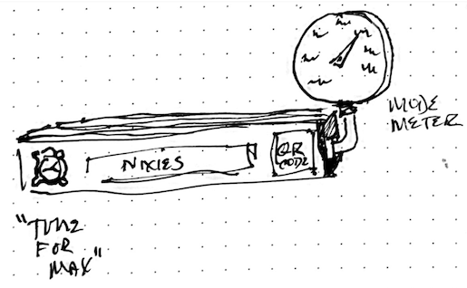
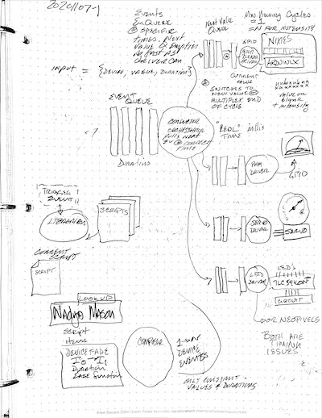

# Playful nixie-and-antique-meter-based clock

## architecture

This has a worker process running as root manipulating the raspberry pi and arduinix hardware to display numbers of various sorts on some nixie tubes. It also uses servos and custom signals to use antique gauges for other displays.

The worker gets its commands via a queue from an express app that allows us to control the nixies from the web using a REST API. The express app also sets up and runs animations on the nixies in response to HTTP requests.

The most basic animation is a clock that updates the nixies once a second. This is the default mode of the system.

There's more, but we'll get to that.

## start up

**These instructions are temporary. Ultimately all of this will be done on power-up and the app will make sure everything is set up correctly.**

0. Install and start a local copy of redis before using this. check out the command:

`npm run start-redis`

and adjust it to match your installation. (Currently I have a simple install that isn't as secure as I'd like. I'll be moving this to a more secure install and then I'll take away this note.)

1. On raspi this requires that  `arduinix/worker.js` runs as root (so it has permissions to manipulate the hardware GPIO pins).

To start the worker process, use:

`npm run start-worker`

2. Finally, start the express server with:

`npm start`

You should see the nixies begin to display the time if everthing works. :-)

Of course, I'll be scripting this so the raspberry pi will start everything up when it boots.
## queue library

I'm using `Bull` because it seems to be better documented compared to its successor `BullMQ`.

More info on the `bull` queue library: https://optimalbits.github.io/bull/

This uses `bull-board`. In chrome, you can see the queues at http://localhost/admin/queues. Bull-board apparently doesn't work on safari.

More info: https://github.com/vcapretz/bull-board

You can also use `bull-repl`:

`npm run bull-repl`

More info at https://github.com/darky/bull-repl

## logging

To be supplied

## animation subsystem

Animations are sequences of device values at given times.

Animations are created by adding delayed jobs to the device-values queues.

Only one animation can run at a time. Starting a new animation flushes the queues before adding the new values and times.

repeating animations are still being worked out. Our currently only repeated animation is the time which is implemented with a node timer that adds a new value to the queue every minute.

## driving hardware with a raspi

