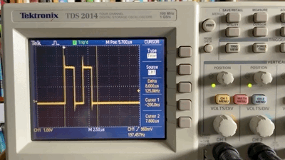

# Playful nixie-and-antique-meter-based clock


## architecture

This has a worker process running as root manipulating the raspberry pi and arduinix hardware to display numbers of various sorts on some nixie tubes. It also uses servos and custom signals to use antique gauges for other displays.

The worker gets its commands via a queue from an express app that allows us to control the nixies from the web using a REST API. The express app also sets up and runs animations on the nixies in response to HTTP requests.

The most basic animation is a clock that updates the nixies once a second. This is the default mode of the system.

There's more, but we'll get to that.


## start up

**These instructions are temporary. Ultimately all of this will be done on power-up and the app will make sure everything is set up correctly.**

0. Install and start a local copy of redis before using this. check out the command:

`npm run start-redis`

and adjust it to match your installation. (Currently I have a simple install that isn't as secure as I'd like. I'll be moving this to a more secure install and then I'll take away this note.)

1. On raspi this requires that  `arduinix/worker.js` runs as root (so it has permissions to manipulate the hardware GPIO pins).

To start the worker process, use:

`npm run start-worker`

2. Finally, start the express server with:

`npm start`

You should see the nixies begin to display the time if everthing works. :-)

Of course, I'll be scripting this so the raspberry pi will start everything up when it boots.
## queue library

I'm using `Bull` because it seems to be better documented compared to its successor `BullMQ`.

More info on the `bull` queue library: https://optimalbits.github.io/bull/

This uses `bull-board`. In chrome, you can see the queues at http://localhost/admin/queues. Bull-board apparently doesn't work on safari.

More info: https://github.com/vcapretz/bull-board

You can also use `bull-repl`:

`npm run bull-repl`

More info at https://github.com/darky/bull-repl

## logging

To be supplied

## animation subsystem

Animations are sequences of device values at given times.

Animations are created by adding delayed jobs to the `device-values` queue.

Only one animation can run at a time. Starting a new animation flushes the queues before adding the new values and times.

repeating animations are still being worked out. Our currently only repeated animation is the time which is implemented with a node timer that adds a new value to the queue every minute.

## driving hardware with a raspi

We use the [pigpio package](https://github.com/fivdi/pigpio) based on the [pigpio library](http://abyz.me.uk/rpi/pigpio/index.html). It's been fairly straightforward setting this up. The only wrinkle is that the code tweaking the hardware has to run with root privleges, so we had to carve that portion out and put it in it's own little process.


Ok, the elephant in the roo- er, ah, project is of course, why are you using a non-realtime linux-and-node-based raspberry pi to directly drive hardware? Because of all the various factors that can effect when things happen, the signals have considerable jitter in them.



The scope shows this simple `pigpio` code running in a 10ms node repeating timer:
```javascript
    pins['testPin'].digitalWrite(1);
    pins['testPin'].digitalWrite(0);
    pins['testPin'].digitalWrite(1);
    pins['testPin'].digitalWrite(0);
```
Note how sometimes these statements take about 1.2uS (microseconds) each, but sometimes it's 2.8uS, or some value in between. The whole sequence is sometimes twice as long. And the timer usually hits 10 milliseconds (mS) but sometimes it can be as long as 10.4 mS between cycles. The point is that timing is only accurate within a small range.


This is not unexpected. JavaScript is not first choice language in embedded systems. Node is not real time, although it is really easy to write asynchronous code and it's really fast. For example, timers are explicitly spec'd to be *at least* the given interval but sometimes longer. And this version of Linux (Raspberry OS) is non-real time. It shouldn't be a problem. But it's not like when I've coded in C & assembler with my own RTOS or used VxWorks back in the day.

But it doesn't matter.

The theme of this project was building something fun out of all the various parts I had sitting around in boxes while using the same technologies, tools, and techniques I use at work. I am Frankenstein and this is my monster.

